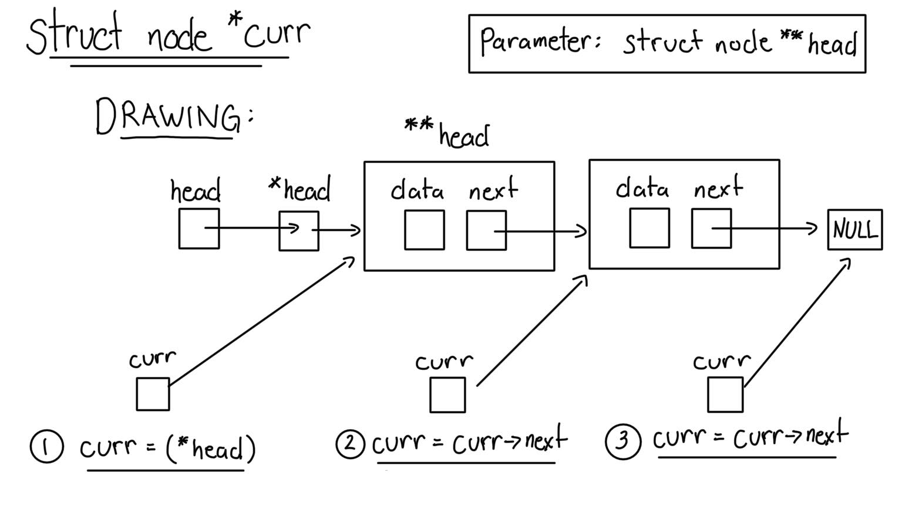
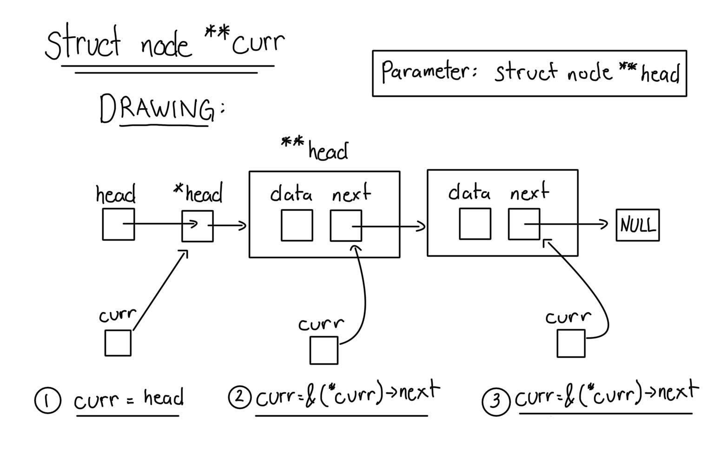

# Linked List
## Fast and Slow pointers
- Used for:
  - Finding midpoint
  - Finding kth node from the end
  - Determining whether list is a cycle
- Fast ptr traverses the list faster than slow ptr does
 - usually Fast traverses two steps at a time, while slow does one step
## struct node \*curr vs struct node \*\*curr
- ### struct node \*curr
  
- ### struct node \*\*curr
  
